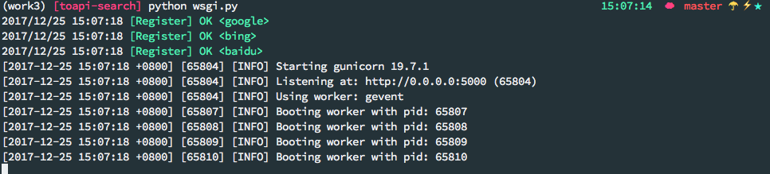

## toapi-search

### What is toapi-search?

This project uses [Toapi](https://github.com/gaojiuli/toapi) to build a friendly and robust API from Google, Bing, Baidu, So, DuckDuckGo etc.


``` shell

# or git clone https://github.com/toapi/toapi-search
toapi new toapi/toapi-search
cd toapi-search
# toapi run
python wsgi.py
```

Then, everything is done, the following content will show on screen:



### Usage:

Once the server is started, you can get JSON data from toapi-search:

Visit `http://0.0.0.0:5000/_items/`

``` json

{
  "/:wd": [
    "google", 
    "bing", 
    "baidu"
  ]
}

```

> http://0.0.0.0:5000/python

``` json

{
    "baidu": [
        {
            "title": "Welcome to Python.org",
            "url": "http://www.baidu.com/link?url=g2_i_ThdQ0aA4WYZ5sIj5Lt3rly1xBA7XY0IkBza_W7DBcn_jJam4k1F9qiFBwZB"
        },
        {
            "title": "Download Python | Python.org",
            "url": "http://www.baidu.com/link?url=nb5pPKHJv403lz96-4EztfUBtWhiw6VDP-HPQrHVexuN8YoXaDnJILQl_Jy8r22j"
        },
        {
            "title": "Python 基础教程 | 菜鸟教程",
            "url": "http://www.baidu.com/link?url=ISKIBt6yMmDv6TM6rH9OvbyzM1j8r-3ZI6LcLg_w8-0BbWBC-OMaLFjl_JiKAkX88gcrlrvAUjcKNtG2Yxs5xa"
        },
        {
            "title": "Python教程 - 廖雪峰的官方网站",
            "url": "http://www.baidu.com/link?url=acz2VD5xN9J6e7R2GDE1vxa9ThpxF3uGHCPqQXvez04bUGUsxxz1S2PqnNhZWQ0ZBVQXTfIdwkInoVR1KmL-6solFSfCoM3C7TDkT5OdeTRK1ttSYRrbtv87-tufAVY9"
        },
        {
            "title": "你是如何自学 Python 的? - 知乎",
            "url": "http://www.baidu.com/link?url=ERdlWXCJNqIfvj-bKT8spkUeF6ORHWshUy6WdsRR2f6y9XWRK9tHg-2aWCxbndVpiXFf4Rn7zdy6LM_8wcz6gq"
        },
        {
            "title": "Python Releases for Windows | Python.org",
            "url": "http://www.baidu.com/link?url=-gL2jvZJVDsWI9aXZE4LO9G5IkMRbxApwf-yHMw9fLyYWXJ-_gylkX9jDNjKfH3EGTn0WocHOQ8-lNamkr9ega"
        },
        {
            "title": "Python - 伯乐在线",
            "url": "http://www.baidu.com/link?url=R0yId0pR9fQMXq615mHSkjNOtpq59wJOx5RWvFrV4Lfd6Ql26MV_teRi519oOqef"
        },
        {
            "title": "Python 简介 | 菜鸟教程",
            "url": "http://www.baidu.com/link?url=HBE46hWbBQim7NbuG7KukYnLSscD3YK4MdNY8MimB5Xq6OgLdkdeAcVYoDKrJTnAngnzcJx-oY-JC6fb5z1edq"
        }
    ],
    "bing": [
        {
            "title": "Python - Official Site",
            "url": "https://www.python.org/"
        },
        {
            "title": "Python (programming language) - Wikipedia",
            "url": "https://en.wikipedia.org/wiki/Python_%28programming_language%29"
        },
        {
            "title": "Python - Tutorial",
            "url": "https://www.tutorialspoint.com/python/"
        },
        {
            "title": "Python - Wikipedia",
            "url": "https://en.wikipedia.org/wiki/Python"
        },
        {
            "title": "Python - Free download and software reviews - …",
            "url": "http://download.cnet.com/Python/3000-2069_4-10080057.html"
        },
        {
            "title": "2. Built-in Functions — Python 3.6.4 documentation",
            "url": "https://docs.python.org/3/library/functions.html"
        },
        {
            "title": "The Python Standard Library — Python 3.6.4 …",
            "url": "https://docs.python.org/3/library/index.html"
        },
        {
            "title": "Learn Python - Free Interactive Python Tutorial",
            "url": "https://www.learnpython.org/"
        },
        {
            "title": "Python - Basic Operators - tutorialspoint.com",
            "url": "http://www.tutorialspoint.com/python/python_basic_operators.htm"
        },
        {
            "title": "Learn Python | Codecademy",
            "url": "https://www.codecademy.com/learn/learn-python"
        }
    ],
    "google": [
        {
            "title": "Welcome to Python.org",
            "url": "https://www.python.org/"
        },
        {
            "title": "Python (programming language) - Wikipedia",
            "url": "https://en.wikipedia.org/wiki/Python_(programming_language)"
        },
        {
            "title": "Python | Codecademy",
            "url": "https://www.codecademy.com/en/tracks/python"
        },
        {
            "title": "Python - Learn Python | Codecademy",
            "url": "https://www.codecademy.com/learn/learn-python"
        },
        {
            "title": "Python Tutorial",
            "url": "https://www.tutorialspoint.com/python/"
        },
        {
            "title": "Python · GitHub",
            "url": "https://github.com/python"
        },
        {
            "title": "Images for python",
            "url": null
        },
        {
            "title": "",
            "url": ""
        }
    ]
}

```

### Deploy:

We recommend that you use Caddy(Nginx) + Gunicorn
